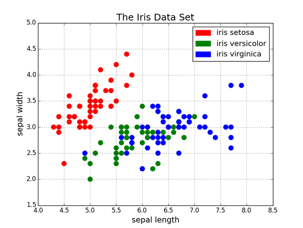

# An introduction to Machine Learning

Now that we have introduced the programming language we'll use in this course, we can enter the second topic of the course, machine learning. But before that, let's just prepare a bit of the work by clarifying the terminology.

## Terminology

Indeed, unless you are already well into the field, it is pretty likely that by now you will have a certain confusion between the different terms that seem to be related, but that also seem to overlap.
What is the difference between _Artificial Intelligence_, _Machine Learning_, _Deep Learning_... ? 
To add to the confusion, the chart below, which reports the frequency of various terms in Google Books across time, shows how the various terms become fashionable in different periods, sometimes becoming a buzzword, only to fall into disuse and then come back again...

Let's hence look at the various terms, with the help of a dictionary

### Artificial Intelligence 

Before we see the dictionary's definitions for _artificial intelligence_, let's try to answer a question: would you say that a pocket calculator, like the one depicted below, uses Artificial Intelligence ? I bet your answer would be negative...

Dictionary definitions for "artificial intelligence":
- _"The theory and development of computer systems able to perform tasks normally requiring human intelligence, such as visual perception, speech recognition, decision-making, and translation between languages."_ (Oxford)
- _"1 : a branch of computer science dealing with the simulation of intelligent behavior in computers"_
- _"2 : the capability of a machine to imitate intelligent human behavior"_ (Merriam-Webster)
- _"The study of how to produce machines that have some of the qualities that the human mind has, such as the ability to understand language, recognize pictures, solve problems, and learn"_ (Cambridge)

As you can read, the definition is given in comparative terms with human intelligence. But what is "intelligence" in the first instance? A definition reads as: "an intelligent agent has a goal, senses its environment and interacts with it, learns from the result of its actions and acts toward achieving its goal, given perceptual limitations and finite computation" (Poole, David; Mackworth, Alan; Goebel, Randy, 1998. Computational Intelligence: A Logical Approach)

But the problem is that what is "normally requiring human intelligence" changes with time. Making arithmetic is surely something deeply connected with the human mind and the possibility that now a machine, a pocket calculator, could do it for us, should have been surely considered a form of "artificial intelligence". However, that sounds much more "obvious" for today's expectations, where we are used to much more. There is a lot of overlap with "progress" in the AI term.

It is still a term that remains pretty vague, so much that the definitions are provided in terms of specific elements that are considered part of AI rather than by defining which are the common characteristics that something should have to be considered AI.

You can see in the chart that the term has been coined in the '50s, with diverse fortunes, and only recently has been "resurged" in specific fields.

I personally prefer not to use this term.

### Machine Learning

Let's look also for _machine learning_ in the dictionary definitions:

- _"The use and development of computer systems that are able to learn and adapt without following explicit instructions, by using algorithms and statistical models to analyse and draw inferences from patterns in data."_ (Oxford)
- _"The process by which a computer is able to improve its own performance (as in analyzing image files) by continuously incorporating new data into an existing statistical model"_ (Merriam-Webster)
- _"The process of computers changing the way they carry out tasks by learning from new data, without a human being needing to give instructions in the form of a program"_ (Cambridge)

A common concept in these definitions is that in ML we try to "learn" a system, its structure, some patterns or how the system relates its input to the outputs, from the data itself, without a predefined "model" of how this relation should be defined.

It follows that machine learning algorithms should be generic. They shouldn't be problem-specific, should not include domain-specific instructions, but rather should _learn_ the problem resolution from the data[^1].
[^1]: This is a remarkable and pretty desirable property to have: you will be surprised by how few algorithms can be applied to so many different contexts.

For example, for the digit recognition exercise that we will see in unit `NN`, we could have created a computer program that works with the following set of instructions: (1) identify the lines by checking for the variation in pixel darkness in a certain direction and when it is higher than a specific threshold, consider it as a line: (2) assign the label "1" if you can find a vertical bar in the centre of the image without any other lines in the middle (where I would have to define the tolerance for both "vertical" and "centre"), and so on…
You can see that it is going to be complex. This is clearly not machine learning. Instead, machine learning should "learn" all these tasks from the data itself.

We can think of machine learning as a sub-field of artificial intelligence, and indeed it is hard to find success stories of AI that are not ML.

Some definitions explicitly name statistical models. But while nothing forbids us to use statistical models as algorithms, statistical models aren't required. We don't need to make any probabilistic assumption concerning the distribution of our data, aside to respect that the data we train our model with has the same characteristics as the data we then use it for.
The algorithm is tested, it is evaluated, not on specific assumptions, even if we use a statistical model, but by measuring its accuracy on data that has not been used in training the algorithm itself.

So, how do machine learning models hence work?
In its most simple way, an ML algorithm learns a relation between some x and the ys, based on some data. This is the "training" step of the algorithm.
Once the model is trained, we use it to produce predictions based on other data, and the algorithm is evaluated on how far these predictions are from the real Y.
If we start to notice that the predictions are no longer good, we need to train again with the new data.

While predictions aren't the only scope of machine learning, we'll see other kinds of machine learning tasks in a couple of sections, it is undisputed that prediction is where machine learning shines, where there have been the greatest successes and the most practical applications.
Similarly, while predictions aren't surely the sole objective of science, many problems can be ultimately reframed with a prediction approach.

But before we continue, a warning is due. Machine learning models, for the way they are trained, may reflect and amplify the biases of society rather than reduce them. If our training data is biased, this bias can make its way into our machine learning models. The output that we may obtain from these models, and the decisions we take based on these outputs, are not necessarily in line with the ethical views of society.
So this is a very important societal issue, and I invite you to document by yourself about it, but it will not be covered in this course.

But why machine learning now ? Why this revival of this specific aspect of artificial intelligence? There are three pillars underpinning the "machine learnings boom" that we are currently experiencing.
The first one is the **algorithmic foundation**.  Algorithms have been improved, and we managed to find algorithms that are empirically very good in generalising a problem, in finding this relation between the X and the Y in general terms, and not restricted to the data that has been used for training them.
The second aspect is the **data availability**. Machine learning requires a lot of data. Often, predictions become good only if the data the model is trained with is large enough. And the availability of data to train the algorithms has exploded with the digitalisation of society. We are now able to collect a large amount of data, including personal data. Again, this opens many issues in the field of privacy, that are not discussed in this course, but are important to consider.

Finally, we have the algorithms and we have the data, the last point is that we have only recently obtained the **computational power**, the means to process these huge amounts of data and run the algorithms over them. Think about the Graphical Processing Units, for example, or the democratisation of cloud infrastructures.

So it is the combination of these three factors together that allowed for the rapid development of machine learning techniques in everyday aspects of society.

### Deep Learning

To complete the definitions, the term "deep learning" refers to the usage of a specific kind of ML model, neural networks, when the model is used with multiple transformation layers between the inputs and the outputs. We'll see neural networks in detail in the `NN` unit, but let's here only notice that while it is difficult to think of successful AI applications that are not ML, there are many ML algorithms in wide use that are not NN.

## A first example: estimating bike rental demand

As our first encounter with machine learning models, let us consider a task where we need to estimate the demand for bike rental for the day (or the hours) in different rental locations, so that the management company can optimise the allocation of the resources across the various spots.
As the input for our estimations we will consider various weather data (temperature, rainy and windy conditions,...), the day of the week, the hour if we need an intra-day estimation, the season, some flags to tell us if the day is working, is a school holiday, or the following day is.
The object of our estimation is the number of bikes rented at that specific location, on that day (and eventually hour).

If we would go for a statistical model, we would write a _model_ like: `Bike rented = α +β₁*temp+β₂ * temp*wday+ …` where the modeller needs to make assumptions about the data and their relations, the variable to include, the covariance between variables...
The goodness of fit (significance) of the estimated parameters then would depend on the above assumptions.
After the model has been estimated, the modeller needs to provide the decision-maker just the above equation and the `α, β₁, β₂, ...` parameters

If we go instead for a machine learning approach, we would use instead a "generic" regression algorithm (for example a decisions tree) and the goodness of the predicted output would be obtained by comparing the ML predictions with the true values for a set of records that have not being used to train the model (we'll see this important concept in detail in the `ML1` unit).
While ML predictions are likely to be more accurate compared to those obtained by an out-of-sample interpolation of the statistical model, there is still a glitch.
Now we don't have any more a _compact_ representation of our model, so we can provide the company with just an equation and its parameters.
For the decision-maker to be able to make predictions, we need now to provide it with the whole "trained" algorithm, so that it can be run by the decision-maker whenever it needs to make predictions.

## Type of Machine Learning areas

ML algorithms differentiate for the predictive capacity, the computational efficiency (both memory and CPU), the necessity of input preprocessing (both simple data transformation and feature-engineering), the possibility to "reverse-engineer" the machinery and "understand" ("interpret") the relation between the X and the Y,...

We can typically distinguish three different kinds of Machine Learning tasks, _supervised learning_, _unsupervised learning_ and _reinforcement learning_, although the most interesting tasks are those where these things are actually mixed up in the same job.

### Supervised learning

In a _supervised learning_ problem, the objective is to predict some new information. This can be to predict the occurrence of some events in the future, such as if a loan holder would default,  if a tree species would be successful in a new environment, or which is the next word you will want to type in a sentence ?
The information to predict can also be just some properties that we don't yet know, such as the objects depicted in an image, or if a bottle of wine is really "Château Pétrus" or it is a fake.

The information to predict, the probability of default for example, is called _label_ or _target_ or simply `Y`, while the characteristics from which to make the prediction – the current debt level, the previous default history, the monthly incomes.. are the `X` or _feature vector_.

If the label is continuous, e.g. the speed a car can go given its characteristics, the task is a _regression_. If the set of possible values the `Y` can take is finite, it is a _classification_ task. 
In supervised learning the algorithm is provided with a set of examples of both the `X` and the corresponding `Y`, i.e. you give "supervision" of what the correct behaviour is, and the algorithm "learns" the mapping from the `X` to the `Y` using these examples, with the caveat that the algorithm will need to learn a "general" mapping from the `X` to the `Y`, and not one specific to the examples we provide to it, so that when we will feed the algorithm a new `X` that the algorithm never saw, it will indicate the correct `Y`. This is the problem of generalisation, the equivalent to overfitting in statistics, actually the opposite of it, and we will discuss it in unit `ML1`.

The step where the algorithm learns the relation from the provided couples is called _training_ and it is often very computationally intensive.
Once the algorithm is trained, it can be used to make _predictions_ of the unknown `Y` based on some new `X`.

On `ML1` we'll have an exercise on digit recognition: we draw a digit, we scan the image and we let the computer guess which digit is represented in the image.
This "simple" task is indeed very hard for a computer and only recently, thanks to ML, has been largely solved. As we discussed earlier, it would be really complex to instruct an algorithm to recognize a digit based on "classical" engineering procedures. You write the number "7" with two lines, I add another horizontal line in the middle, you type it perfectly vertical, I give it a bit of a slant.. you close perfectly the "zero", while I leave a small gap… For this kind of digit recognition task it is much simpler to just teach the classification with examples, and let the algorithm find which are the characteristics that make it more likely a digit to be a "9" rather than an "8" for example. 

## Unsupervised learning

Another area of application of machine learning is to automatise the discovery of information hidden in large datasets, often highly multidimensional.

In unsupervised machine learning tasks, we ask the algorithm to "scan" the data and find patterns, hidden structures that would be difficult to retrieve manually.  In this class of tasks, we don't provide a label, we let the algorithm find a result from the data by itself.

A typical example is to recognise the presence of a structure that leads to distinguish between different groups in the data, i.e. divide the data into several clusters.  We will see an example using the famous "sepal" dataset – a dataset where the floral species is determined from morphological measures of flower parts. In this case, we could also apply supervised learning, as the `Y` – the plant species – is included in the dataset, but even if this information would not be part of the dataset, a clustering algorithm would be able to separate the observations in different species.

Other examples are the algorithms of dimensionality reduction, where we want to reduce the number of dimensions where our data live in, to be able to represent them or to further process for other ML algorithms. We will see the Principal Component Analysis, PCA, a technique that linearly transforms the data following the dimensions where the variance is maximised.

## Reinforcement learning

Finally, we can consider reinforcement learning tasks.
Somehow similar to supervised learning, here the algorithm is provided with a feedback, how "good" the solution it arrived is, but the feedback concerns only the very final state deriving from the set of decisions the algorithm has taken. So we will have many attempts, or "games", each one composed of various actions that the algorithm takes and each action changes the current state of the world until we arrive at a final state and at this time the algorithm is provided with a feedback on how good that "final" state is.  The algorithm will have then to track down how the individual decisions that it made relate to the final outcome.

Note that this is actually a very broad topic, it isn't restricted to board games like Chess or Go or to robotic simulations. For example, it can be applied in a business context where we are trying to get customers to sign a contract and have to decide the best actions between sending emails, making phone calls, organising a physical meeting, and so on...
What is important again is that we need to have a lot of data and, as in the business example, be prepared for many "failures", at least initially. It can't be applied to situations where it is imperative to succeed in something on our first attempt, as we would miss the "experience" that the algorithm requires for training.

Indeed, at the heart of reinforcement learning, there is a universal concept known as **exploration vs exploitation**. The way to train a reinforcement learning algorithm includes a first step where the initial experience is not available, or it is very limited, and we should let the algorithm "explore" the various options with the objective indeed to achieving a large and diverse experience, to then gradually shift toward more and more usage of this experience, "exploit" the accumulated experience and reducing the exploration.

This is very much what happens in learning in everyday situations. Have you ever heard the expression "terrible tree" with reference to toddlers ? Toddlers at this age look really "terrible", as they are "exploring" the world around them, and making the most "crazy" experiments,  like spilling a glass of water on the floor, putting the shoes in a puddle, pulling the pet's tail – or eating the dog's nuggets… Only later do kids learn "how to behave", that is the effect of their actions and start using their knowledge. But this is true also in biological systems. When you are young, your immune system doesn't yet know the pathogens, and its response is much more general and dynamic. Adult immune response conversely is much more targeted to the "know pathogen" list, it exploits the experience accumulated over a lifetime. This is why a "new" pathogen is much more dangerous to old people than to young ones, as the experience with the covid-19 has dramatically shown.
So, as in these real-world situations, efficient reinforcement learning algorithms require a training that switches from first exploring the options available, to one exploiting the accumulated experience.

## Further examples

You can get an idea of ML tasks by looking at the various tutorials of the [BetaML documentation](https://sylvaticus.github.io/BetaML.jl/stable/tutorials/Betaml_tutorial_getting_started.html), a machine learning library written in Julia that we'll use across the course:  

- [A regression task: the prediction of bike-sharing demand](https://sylvaticus.github.io/BetaML.jl/stable/tutorials/Regression%20-%20bike%20sharing/betaml_tutorial_regression_sharingBikes.html)
This is the implementation of the example we discussed above
- [A classification task when labels are known - determining the country of origin of cars given the cars' characteristics](https://sylvaticus.github.io/BetaML.jl/stable/tutorials/Classification%20-%20cars/betaml_tutorial_classification_cars.html)
In this exercise, we have some car technical characteristics (mpg, horsepower, weight, model year...) and the country of origin and we would like to create a model such that the country of origin can be accurately predicted given the technical characteristics. As the information to predict is a multi-class one, this is a classification task. It is a challenging exercise due to the simultaneous presence of three factors: (1) presence of missing data; (2) unbalanced data - 254 out of 406 cars are US-made; (3) small dataset.
- [A clustering task: the prediction of plant species from floral measures (the iris dataset)](https://sylvaticus.github.io/BetaML.jl/stable/tutorials/Clustering%20-%20Iris/betaml_tutorial_cluster_iris.html)
The task is to estimate the species of a plant given some floral measurements. It uses the classical "Iris" dataset. Note that in this example we are using clustering approaches, so we try to understand the "structure" of our data, without relying upon the true labels ("classes" or "factors"). However we have chosen a dataset for which the true labels are actually known, so to compare the accuracy of the algorithms we use, but these labels will not be used during the algorithm's training.

## ML - final remarks

While the applications of ML, the sectors where ML can be applied, are really diverse, the set of algorithms that we need to study is surprisingly relatively small, as the same algorithm can be applied to very different situations.

More than for the specific application, ML algorithms differ in their predictive capacity – although some ML algorithms can have better predictions for some jobs than others and be worst for other tasks.
They also differ in the computational resources they require. Some algorithms are trivially parallelizable, so they perform very well if Graphical Processing Units (GPUs) or TPUs are available.
Another important element to decide which algorithm to use is how easily it adapts to the kind of data we have (more than to the problem we have). For example, random forests algorithms can be trained with almost everything directly, while neural networks require numerical data only, and hence we need for example to transform a field "weekday" to a bunch of "ones/zeros" to code the same information.
Finally, while ML algorithms are traditionally presented as "black boxes", there are techniques that allow retrieving some insights into the way they form their predictions, on the contribution of the input dimension to the prediction.

Still, a major drawback of ML for which there is still a lot of work going on, is the current difficulty in using the knowledge learned by a model in a given task to perform other, more or less related, tasks.
Most of the time we start from zero at each task, we "just" train the new model from scratch, requiring large computational and data retrieval efforts.
But the key to "learning", at least for intelligent agents, is the capacity to generalise the learned tasks and transfer this knowledge to solve new tasks. Something that goes under the name of "transfer learning".
For example, the basic law of physics that a kid learns using her building blocks toys can be used later on in life during adulthood.

We close here this long "introductory" lesson and we'll start in the next lesson to dig a bit more in-depth the topics that we introduced today.