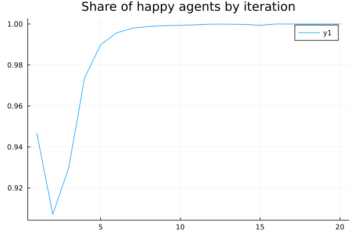

# EXERCISE 1.1: The Schelling Segregation Model


```@raw html
<p>&nbsp;</p>
 
 
  

<p>&nbsp;</p>
```

Your job is to implement the [Shelling Segregation Model](https://en.wikipedia.org/wiki/Schelling%27s_model_of_segregation), a classical agent-based model in the social sciences, introducing the concepts of emerging macro behaviours and tipping points, leading to its author (Thomas Schelling) receiving the Nobel prize in Economics in 2005.

It has been one of the very first results obtained from running simulations, especially in the social sciences.
The World is modelled as a gridded space inhabited by two groups (in that period racial and segregation questions concerning the cohabitation of "blacks" and "whites" were topical).
Each group has a preference to live in a neighbourhood inhabited by agents of their own type, with a certain "tolerance". When the share of agents of its own type in the neighbourhood falls below this "tolerance" level, the agent tries to relocate somewhere with a higher share of its own type of agents.
The main result of the paper was that even a relatively mild preference for the presence of similar agents would have led to a segregated world and that there was a specific threshold level (between 30% and 40%) that was driving these two completely different outputs, i.e. a "tipping point".

The simulation algorithm then goes in this way:
For each step, look at each agent, check if it is "happy" with its current location (looking at the share of own types in the neighbourhood), and, if not, relocate the agent to a position where it would be (setting its past location as empty).

There are various ways of "generality" vs "specificity" to code the algorithm above. On one end you could hard-code the two agent types, e.g. as `1` and `2`, on the other you could be very generic and create an abstract type `Agent` and a concrete class for each agent type.

The skeleton below proposes an intermediate approach with only one `Agent` class and the kind of agent encoded as an integer, with 0 representing an empty cell. Fill free to use it or to develop your own algorithm from scratch!

Source: Thomas C. Schelling (1971) Dynamic models of segregation, The Journal of Mathematical Sociology, 1:2, 143-186, DOI: [10.1080/0022250X.1971.9989794](https://doi.org/10.1080/0022250X.1971.9989794) 


## Instructions

If you have already cloned or downloaded the whole [course repository](https://github.com/sylvaticus/SPMLJ/) the folder with the exercise is on `[REPOSITORY_ROOT]/lessonsMaterial/01_JULIA1/shellingSegregationModel`.
Otherwise download a zip of just that folder [here](https://downgit.github.io/#/home?url=https://github.com/sylvaticus/SPMLJ/tree/main/lessonsMaterial/01_JULIA1/shellingSegregationModel).

In the folder you will find the file `shellingSegreGationModel.jl` containing the julia file that **you will have to complete to implement and run the model** (follow the instructions on that file). 
In that folder you will also find the `Manifest.toml` file. The proposal of resolution below has been tested with the environmend ddefined by that file.  
If you are stuck and you don't want to lookup to the resolution above you can also ask for help in the forum at the bottom of this page.
Good luck! 

## Resolution

Click "ONE POSSIBLE SOLUTION" to get access to (one possible) solution for each part of the code that you are asked to implement.

------------------------------------------------------------------------------
### 1) Setting the environment...
```julia
cd(@__DIR__)         
using Pkg             
Pkg.activate(".")   
# If using a Julia version different than 1.7 please uncomment and run the following line (reproductibility guarantee will hower be lost)
# Pkg.resolve()   
Pkg.instantiate()
using Random
Random.seed!(123)
using Plots
```

------------------------------------------------------------------------------
### 2) Defining the `Agent` and `Env` classes... 

```julia
mutable struct Agent
    gid::Int64
end
mutable struct Env
    nR::Int64                       # number of rows
    nC::Int64                       # number of columns
    similarityThreeshold::Float64   # threeshold for agents to be "happy" with their location
    neighborhood::Int64             # how far looking for "similar" agents
    nSteps::Int64                   # number of iteractive steps to employ
    cells::Vector{Agent}            # total cells in the environment
    gids::Vector{Int64}             # ids of the agents types (or "groups")
    grsizes::Vector{Int64}          # number of agents per group
end
```

------------------------------------------------------------------------------
### 3) Defining some utility functions... 
```julia
xyToId(x,y,nR,nC) =  nR*(x-1)+y
iDToXY(id,nR,nC)  =  Int(floor((id-1)/nR)+1), (id-1)%(nR)+1
printableGrid(env) = reshape([a.gid for a in env.cells],env.nR,env.nC)
```

------------------------------------------------------------------------------
### 4) Defining the main functions of the algorithm...
```julia
"""
   getNeighbours(x,y,env,gid=nothing)

Return the number of total neighbours if `gid` is `nothing` (skipping the empty cells) or of a specific `gid` if this one is provided.

"""
function getNeighbours(x,y,env,gid=nothing)
    board  = reshape(env.cells,env.nR,env.nC)
    region = board[max(1,y-env.neighborhood):min(nR,y+env.neighborhood),max(1,x-env.neighborhood):min(nC,x+env.neighborhood)]
    ## [...] Write your code here 
```

```@raw html
<details><summary>ONE POSSIBLE SOLUTION</summary>
```
```julia
    if gid == nothing
        return sum(getproperty.(region, :gid) .!= 0) # return all agents that are not zero
    else
        return sum(getproperty.(region, :gid).== gid)
    end
```
```@raw html
</details>
```

```julia
end
```

```julia
"""
   isHappy(x,y,a,env)

Return whether the specific agent `a` is happy at his current location
"""
function isHappy(x,y,a,env)
   ## [...] Write your code here
```

```@raw html
<details><summary>ONE POSSIBLE SOLUTION</summary>
```
```julia
    totalNeighbours  = getNeighbours(x,y,env)
    myTypeNeighbours = getNeighbours(x,y,env,a.gid)
    return myTypeNeighbours/totalNeighbours > env.similarityThreeshold
```
```@raw html
</details>
```

```julia
end

"""
   reallocatePoints!(env)

Loop over all the cells and if an agent on that location is unhappy, it moves it to a location where it is happy and set the departing cell as empty (i.e. occupied by an agent whose gid is zero).
It returns the share of agents that were happy before the move.
"""
function reallocatePoints!(env)
    happyCount = 0
    for (i,a) in enumerate(env.cells)
       ## [...] Write your code here
```

```@raw html
<details><summary>ONE POSSIBLE SOLUTION</summary>
```
```julia
        gid = a.gid
        if gid == 0 continue; end
        (x,y) = iDToXY(i,env.nR,env.nC)
        if isHappy(x,y,a,env)
            happyCount += 1
        else
            candIds = shuffle(1:env.nR*env.nC)
            for cId in candIds
                if env.cells[cId].gid != 0 continue; end
                (xc,yc) = iDToXY(cId,env.nR,env.nC)
                if isHappy(xc,yc,a,env)
                    env.cells[cId] = Agent(gid)
                    env.cells[i]   = Agent(0)
                    break
                end
            end
        end
```
```@raw html
</details>
```

```julia
    end
    return happyCount/sum(env.grsizes)
end

"""
    run!(env)

Run the reallocation algorithm for the given steps printing a heatmap at each iteration.
Also, print at the end the chart of the happy agents by epoch
"""
function run!(env)
    outplot = heatmap(printableGrid(env), legend=nothing, title="START", color=mypal,aspect_ratio=env.nR/env.nC, size=(600,600*env.nR/env.nC))
    nHappyCount = Float64[]
    display(outplot)
    for i in 1:env.nSteps
        println("Running iteration $i...")
        nHappy = reallocatePoints!(env)
        push!(nHappyCount,nHappy)
        outplot = heatmap(printableGrid(env), legend=nothing, title="Iteration $i", color=mypal,aspect_ratio=env.nR/env.nC, size=(600,600*env.nR/env.nC))
        display(outplot)
    end
    happyCountPlot = plot(nHappyCount,title="Share of happy agents by iteration")
    display(happyCountPlot)
end
```

------------------------------------------------------------------------------
### 5) Setting the parameters of the specific simulation to run...

```julia
# Parameters...
nR         = 200
nC         = 200
nSteps     = 20
similarityThreeshold = 0.4         # Agent is happy if at least 40% similar
neighborhood = 5                   # Defining how far looking for similar agents
mypal        = [:white,:red,:blue] # First colour is for the empty cell
gids         = [1,2]               # Gid 0 is reserved for empty cell
grShares     = [0.4,0.4]           # Shares of cells occupied by agents, by type
```

------------------------------------------------------------------------------
### 6) Initialising the simulation with the given parameters...

```julia
nCells  = nR*nC
nGroups = length(gids)
grsizes = Int.(ceil.(nCells .* grShares))

cells  = fill(Agent(0),nCells)
count = 1
for g in 1:nGroups
    [cells[j] = Agent(gids[g]) for j in count:count+grsizes[g]-1]
    count += grsizes[g]
end 

shuffle!(cells)
env = Env(nR,nC,similarityThreeshold,neighborhood,nSteps,cells,gids,grsizes)
heatmap(printableGrid(env), legend=nothing, title="Iteration 0", color=mypal,aspect_ratio=env.nR/env.nC, size=(600,600*env.nR/env.nC))
```

------------------------------------------------------------------------------
### 7) Running the model...
```julia
run!(env)
```

------------------------------------------------------------------------------
### 8) Optional variations...

You can try to implement variations of this model. Some ideas:
- implement multiple agent groups;
- run Monte-Carlo simulations with respect to the tolerance threshold, with it being a property of the agent rather than of the group, perhaps with the group having a certain distribution of it and each agent of that group sampling from it;
- implement two thresholds, with one to define happiness and one to define the actual decision to move (to consider costs associated with relocation);
- ....
